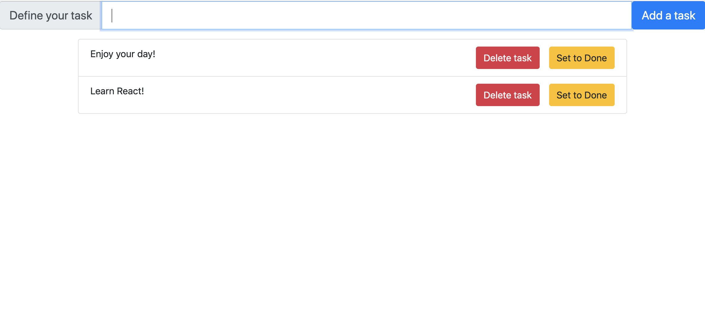

## Instructions for students:

### Create a ToDoList

-   The user should be able to add TODO items to a list using the input field.
    - The Input field should have the placeholder "Add a task"
    - The user should be able to add a task by clicking the "Add a Task" button
    - The items should be `li` elements
-   The user should be able to mark an item as completed
    - Each item should have a "Set to Done" button
    - Items should be striked through when they are completed. Add the class `.done` to the `li` element in order to achieve this.
-   The user should be able to delete an item
    - Each item should have a "Delete task" button
    - When the user clicks the button, the item should be removed from the list.

Note: You may want to use the `useState` hook to manage the state of the to-do list in the App.js file.

-   Here is an image for reference:
    

**Bonuses**

-   The user should be able to edit an item.
-   Implement a react transition/animation when adding an item to the list.
-   User should be able to add an item by pressing the enter key as well as the button.

### Rules

-   This is an individual assignment.
-   Deadline: 2 Hrs.
-   Use **Git properly**
-   Feel free to document your code with comments.

[//]: # (autograding info start)
#  Results
> ⌛ Give it a minute. As long as you see the orange dot  on top, CodeBuddy is still processing. Refresh this page to see it's current status.
>
> This is what CodeBuddy found when running your code. It is to show you what you have achieved and to give you hints on how to complete the exercise.

### Add Task

|                 Status                  | Check                                                                                    |
| :-------------------------------------: | :--------------------------------------------------------------------------------------- |
|  | 'Add a Task' button should exist on page |
|  | Input field with placeholder 'Add a task' should exist on page |
|  | Should allow user to add a task |

### Complete Task

|                 Status                  | Check                                                                                    |
| :-------------------------------------: | :--------------------------------------------------------------------------------------- |
|  | Each item should have a 'set to done' button |
|  | Should allow User to mark tasks as completed |

### Delete Task

|                 Status                  | Check                                                                                    |
| :-------------------------------------: | :--------------------------------------------------------------------------------------- |
|  | Each item should have a 'delete' button |
|  | Should allow User to Delete tasks |

[🔬 Results Details](../../actions)
[🐞 Tips on Debugging](https://github.com/DCI-EdTech/autograding-setup/wiki/How-to-work-with-CodeBuddy)
[📢 Report Problem](https://docs.google.com/forms/d/e/1FAIpQLSfS8wPh6bCMTLF2wmjiE5_UhPiOEnubEwwPLN_M8zTCjx5qbg/viewform?usp=pp_url&entry.652569746=SPA-ToDoList)

[//]: # (autograding info end)